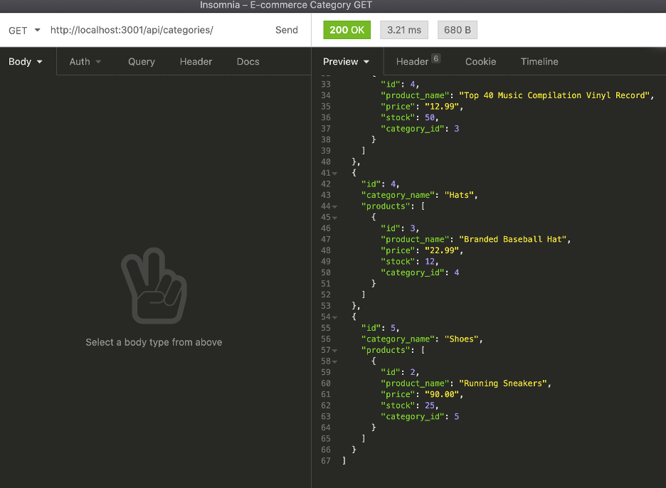

# E-commerce-ORM

## Description
Interact with the back-end database to view the E-commerce categories, products, tags and product tags. With support by Insomnia Core, you can create (POST), read (GET), update (PUT), and delete (DELETE) data within the databases, 

## Table of Contents 
* [Installation](#installation)
* [Usage](#usage)
* [Credits](#credits)
* [License](#license)

## Installation 
Ensure packages are installed after git cloning the repo. Type the following into the command line "npm init -y", "npm install express sequelize mysql2", and "npm install dotenv". You will need to create the database within mysql and to login you will type "mysql -u root -p", and then type "source schema.sql". This will create the database and you can type "quit" to exit mysql command line. Once the packages are installed, update the .env file with your mysql password and then type "echo '.env' >> .gitignore" into the command line to hide the .env file. This will protect your log in credentials. 

## Usage
To begin interacting with the ecommerce_db, you will go to the command line in the root directory of the repo, and type "node server.js" or "node server" and from there, open Insomnia Core to interact with GET, POST, PUT and DELETE.

## Link to demo video:
https://drive.google.com/file/d/1cm4h5th1XV-erThIFrT-qVcTI7zp7EFr/view

## Credits
UofA Coding Bootcamp starter code

## License
Node.js, MySQL, Heroku, Insomnia Core

## Contributing
To contribute, view the open issues tab within the Github repo and following the listed directions if posted. 